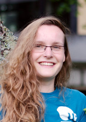

I am *Gesina Schwalbe*, a researcher in the field of responsible artificial intelligence at [Continental AG][conti], Research and Advanced Engineering department.
In 2022 I received my doctoral degree from the [University of Bamberg][cogsys] for my [thesis][thesis] on methods for the safety assurance of deep neural networks (DNNs) in automotive computer vision, advised by [Prof. Dr. Ute Schmid][schmid].

By now my research interests are methods for assuring safe, secure, and ethical DNNs for computer vision, with a focus on using methods from explainable AI and uncertainty estimation.
One of the favorite projects I worked in regarding this is [KI-Absicherung](https://ki-absicherung.vdali.de/).

[me]: figures/me.jpg "Dr. rer. nat. Gesina Schwalbe"
[cogsys]: https://www.uni-bamberg.de/en/cogsys/ "Department Cognitive Systems, Faculty of Information Systems and Applied Computer Sciences, University of Bamberg"
[conti]: https://www.continental-automotive.com/ "Continental Automotive GmbH"
[schmid]: https://www.uni-bamberg.de/en/cogsys/schmid-ute/ "Prof. Dr. Ute Schmid"
[thesis]: https://fis.uni-bamberg.de/handle/uniba/57172 "Concept Embedding Analysis Based Methods for the Safety Assurance of Deep Neural Networks"
